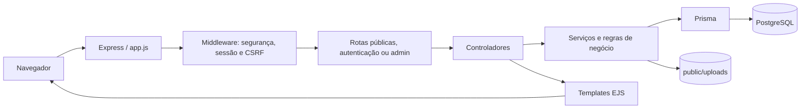

# Arquitetura técnica

## Stack e limites

O portal é uma aplicação web monolítica renderizada no servidor:

- Node.js, Express e templates EJS;
- PostgreSQL para conteúdo, auditoria e sessões;
- Prisma 6 para acesso ao banco e migrações;
- JavaScript e CSS no navegador, sem framework frontend;
- Multer e Sharp para receber e processar imagens.

O processo web e os uploads locais formam uma única unidade de implantação. Para várias instâncias, será necessário adotar armazenamento de mídia compartilhado e rate limiting compartilhado.

## Fluxo de uma requisição

`server.js` valida dependências, inicia o servidor e coordena o encerramento. `app.js` monta middleware e rotas. Controladores cuidam do fluxo HTTP; serviços concentram regras e operações; validadores Zod verificam entradas; templates renderizam a resposta.

## Organização do código

| Caminho        | Responsabilidade                                           |
| -------------- | ---------------------------------------------------------- |
| `server.js`    | Inicialização, conexão e encerramento.                     |
| `app.js`       | Configuração do Express, sessões, segurança e rotas.       |
| `config/`      | Ambiente, cliente Prisma e sessão PostgreSQL.              |
| `routes/`      | Endereços públicos, autenticação e administração.          |
| `controllers/` | Entrada HTTP, respostas e renderização.                    |
| `services/`    | Conteúdo, autenticação, usuários, configurações e uploads. |
| `validators/`  | Schemas de entrada e limites.                              |
| `middleware/`  | Autorização, CSRF, upload e erros.                         |
| `views/`       | Templates públicos, administrativos e parciais.            |
| `public/`      | CSS, JavaScript e mídia pública.                           |
| `prisma/`      | Schema, migrações e seed.                                  |
| `tests/`       | Testes de segurança, unidade, templates e integração.      |

## Modelo de dados

| Modelo        | Finalidade e relações principais                              |
| ------------- | ------------------------------------------------------------- |
| `User`        | Conta administrativa, perfil, estado e autoria de ações.      |
| `Page`        | Página institucional estruturada.                             |
| `Category`    | Classificação de publicações; possui vários `Post`.           |
| `Post`        | Publicação com autor, categoria, estado e agendamento.        |
| `WorkArea`    | Linha de trabalho com ordem e estado ativo.                   |
| `GalleryItem` | Imagem publicada na galeria.                                  |
| `Setting`     | Par chave/valor para identidade e dados institucionais.       |
| `Contact`     | Mensagem recebida pelo formulário público.                    |
| `AuditLog`    | Registro de alterações administrativas sem conteúdo sensível. |
| `Session`     | Tabela técnica consumida por `connect-pg-simple`.             |

Slugs são únicos dentro de cada tipo de conteúdo. Conteúdo e auditoria são persistidos na mesma transação nas operações administrativas suportadas.

## Rotas

Rotas públicas principais:

- `/`, `/sobre-nos`, `/doar`, `/emergencia` e `/contato`;
- `/paginas/:slug`;
- `/linhas-de-trabalho` e `/linhas-de-trabalho/:slug`;
- `/blog` e `/blog/:slug`;
- `/galeria`;
- `/theme.css`, gerado com as cores configuradas;
- `/health`, verificação de prontidão.

O painel usa `/admin`, com autenticação em `/admin/login`. Recursos editoriais compartilham o controlador CRUD e uma lista explícita de modelos e permissões em `services/content.service.js`. Usuários, configurações e contatos possuem controladores próprios.

## Visibilidade de conteúdo

Uma publicação pública precisa ter estado `PUBLISHED` e `publishedAt` menor ou igual ao instante atual. Data futura representa agendamento. Rascunho e arquivo nunca são retornados pelas consultas públicas.

Páginas usam um campo de publicação, linhas de trabalho usam um campo ativo e itens da galeria usam um campo de publicação. A aplicação retorna 404 para conteúdo inexistente ou indisponível.

## Identidade visual dinâmica

Configurações ficam no banco. O endpoint `/theme.css` valida cores hexadecimais de seis dígitos e deriva variações usadas pelo CSS. A resposta não é armazenada em cache, por isso alterações aparecem na próxima requisição. O logotipo usa o mesmo pipeline seguro dos demais uploads, com limite de dimensões próprio.

## Segurança

- bcrypt com custo 12 para senhas;
- sessão PostgreSQL regenerada no login, cookie HttpOnly, SameSite=Lax e Secure em produção;
- autorização por perfil no backend;
- token CSRF vinculado à sessão em mutações;
- Helmet e política CSP;
- rate limit global e limites mais estritos em login e contato;
- corpos HTTP limitados, validação Zod e saída EJS escapada;
- revogação de sessões após alterações em contas;
- trava transacional para preservar a última conta `SUPER_ADMIN` ativa;
- erros centralizados sem stack trace ou detalhes do banco em produção.

O conteúdo editorial é texto simples escapado. HTML fornecido por usuários não é executado.

## Uploads

O middleware aceita JPG/JPEG, PNG e WebP com até 5 MB. O serviço decodifica e valida a imagem, rejeita mais de 25 megapixels, remove metadados durante o reprocessamento, limita dimensões e grava WebP com nome UUID.

Os arquivos ficam em subdiretórios de `public/uploads`. A aplicação remove uploads novos quando a gravação no banco falha e tenta remover o arquivo anterior em substituições e exclusões. Uma interrupção abrupta ainda pode deixar arquivo órfão, portanto banco e uploads devem participar do mesmo plano de backup e manutenção.

## Observabilidade atual

`/health` verifica a prontidão da aplicação e do banco. Erros e falhas de limpeza são enviados para a saída do processo. Não há integração nativa com métricas, rastreamento distribuído ou serviço externo de logs; a plataforma de implantação deve coletar stdout/stderr e monitorar o endpoint de saúde.
